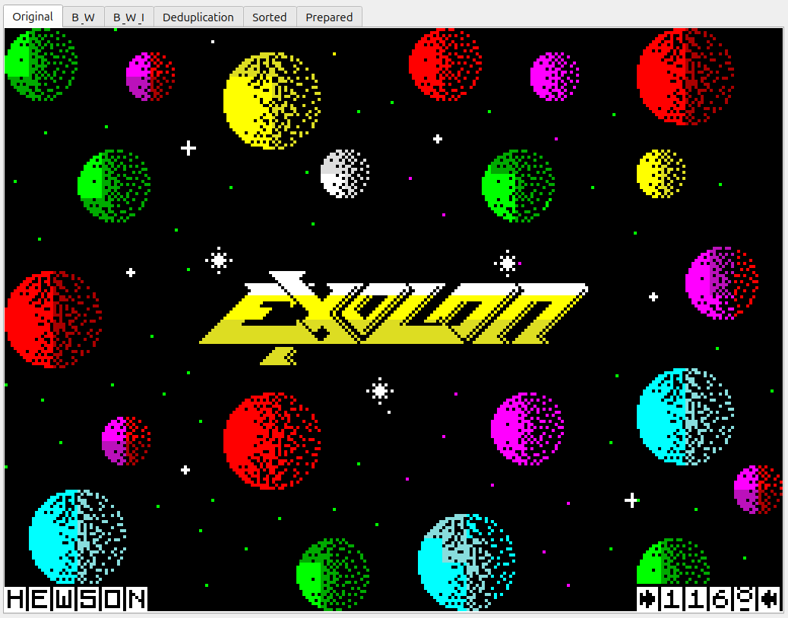
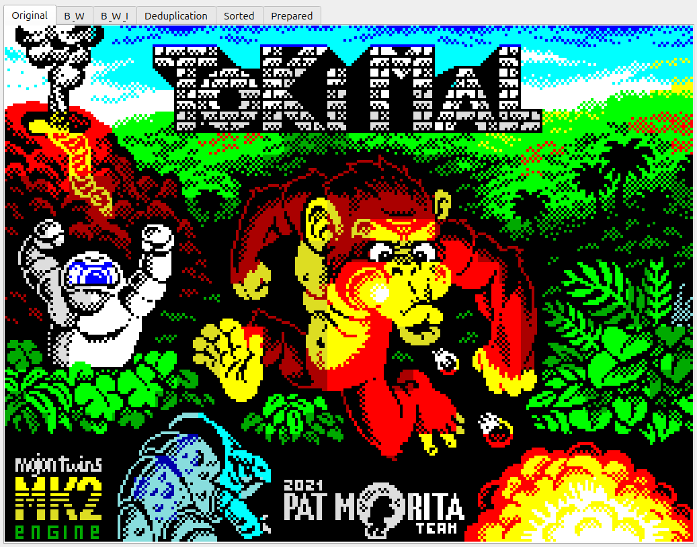
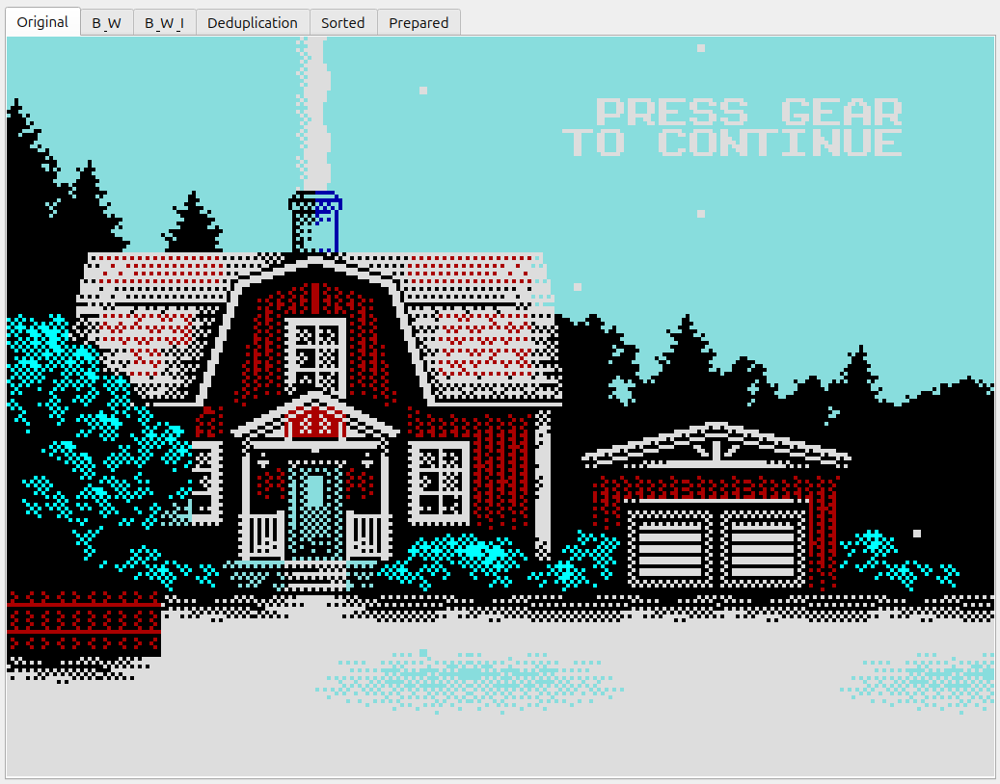
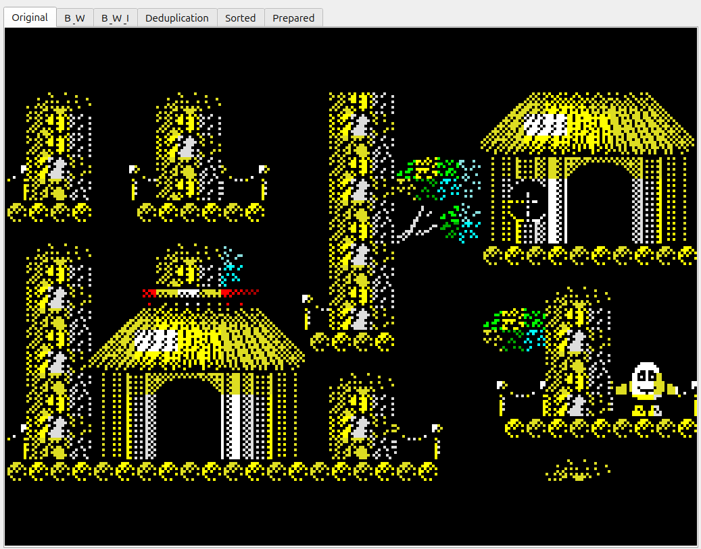
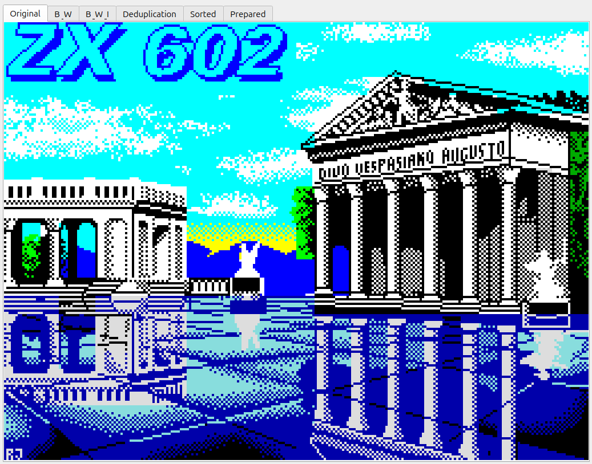
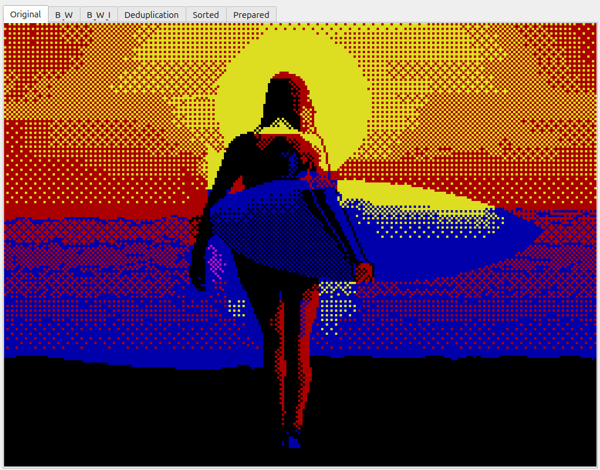
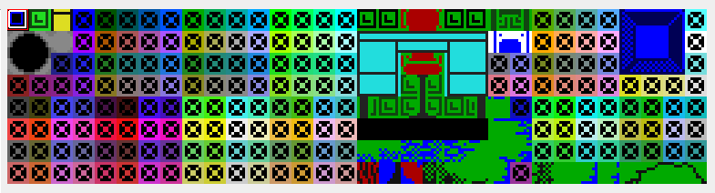
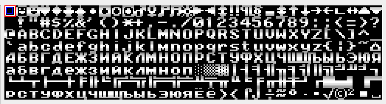

-------------------------------------------
PRE-FILTER-1    BLOCKMOVE
-------------------------------------------

***Block Move / Transform***

*Operation based on counter*


+ Parameters	:
	<filename_in>		Input File Name / Входной файл
	<offset_bytes>		Смещение внутри исходного файла - стартовая точка для операций трансформации
	<transform.yaml>	Параметры трансформации (.yaml file )
	<filename_out>		Output File Name / Файл результата


---
#### Как проводились тесты 

1. Для каждой картинки запускался фильтр преобразования ( zx_filter_a zx_filter_b для 1-6 , cl_filter_a cl_filter_b для 7-8 )
2. В результате получены папки results1-results8 , results1a-results8a , results1b-results8b
3. Архивирование всех выходных результатов набором компрессоров ( zip arj 7zip xz ... и другими )
4. Составление таблицы результатов


---

## Visual Samples


| <br>`example1.scr`<br>HEWSON    | <br>`example2.scr`<br>Jarlaxe    | <br>`example3.scr`<br>Manu       |
| ------------------------------------------------------------------------ | ------------------------------------------------------------------------- | ------------------------------------------------------------------------- |
| <br>`example4.scr`<br>moroz1999 | <br>`example5.scr`<br>Rado Javor | <br>`example6.scr`<br>mr r0ckers |


| Preview                                   | File           | Author     |
| ----------------------------------------- | -------------- | ---------- |
|  | `example7.bin` | V01G04A81  |
|  | `example8.bin` | V01G04A81  |

---
#### Test Files

	example1.scr		HEWSON - Exolon Title
	example2.scr		Jarlaxe - Tokimal (2021).scr
	example3.scr		Manu - Sven's home in the snow (2021).scr
	example4.scr		moroz1999 - Crystal Kingdom Dizzy in-game 01 (2017).scr
	example5.scr		Rado Javor - ZX602 (1994).scr
	example6.scr		mr r0ckers - Blue Surf (2015) (Chaos Constructions 2015, 1).scr
	screen7.scr 		V01G04A81 Exoloneur Test Cells
	screen8.scr 		V01G04A81 Custom Font 8x8

---

## Compression Benchmark

> Values represent: **original → transformed → fragmented**

| Базовый файл (размер)     | LZMA               | XZ                 | 7z                 | RAR                | GZ                 | BZ2                | ZIP                | ARJ                |
|---------------------------|--------------------|--------------------|--------------------|--------------------|--------------------|--------------------|--------------------|--------------------|
| example1.scr (6912)       | 1876 / 1648 / 1348 | 1924 / 1696 / 1396 | 1988 / 1784 / 1464 | 2115 / 1953 / 1524 | 2163 / 2193 / 1464 | 2367 / 2350 / 1777 | 2306 / 2337 / 1608 | 2329 / 2374 / 1618 |
| example2.scr (6912)       | 5433 / 5360 / 4999 | 5480 / 5404 / 5044 | 5545 / 5490 / 5137 | 5656 / 5608 / 5327 | 5493 / 5467 / 5215 | 6127 / 6117 / 5561 | 5636 / 5611 / 5359 | 5602 / 5570 / 5317 |
| example3.scr (6912)       | 2591 / 2465 / 2151 | 2636 / 2512 / 2196 | 2702 / 2576 / 2262 | 2770 / 2663 / 2294 | 2792 / 2718 / 2259 | 3057 / 3048 / 2690 | 2935 / 2862 / 2403 | 2914 / 2838 / 2384 |
| example4.scr (6912)       | 1751 / 1592 / 1049 | 1796 / 1640 / 1096 | 1862 / 1721 / 1168 | 1897 / 1816 / 1205 | 1949 / 1992 / 1146 | 2211 / 2196 / 1464 | 2092 / 2136 / 1289 | 2095 / 2134 / 1263 |
| example5.scr (6912)       | 4208 / 4039 / 3906 | 4256 / 4084 / 3952 | 4363 / 4172 / 4027 | 4479 / 4354 / 4058 | 4368 / 4285 / 4056 | 4923 / 4909 / 4603 | 4511 / 4429 / 4200 | 4498 / 4413 / 4183 |
| example6.scr (6912)       | 1981 / 1911 / 1841 | 2028 / 1956 / 1888 | 2108 / 2033 / 1962 | 2117 / 2048 / 2022 | 2099 / 2050 / 1990 | 2253 / 2272 / 2192 | 2242 / 2194 / 2134 | 2224 / 2165 / 2113 |
| example7.bin (16384)      | 1803 / 1852 / 1723 | 1848 / 1900 / 1768 | 1561 / 1923 / 1828 | 2329 / 2304 / 2784 | 3203 / 3133 / 2764 | 3688 / 3704 / 3381 | 3346 / 3277 / 2908 | 3415 / 3336 / 2939 |
| example8.bin (16384)      | 1688 / 1730 / 1579 | 1736 / 1776 / 1624 | 1780 / 1814 / 1682 | 1914 / 1948 / 1766 | 1953 / 1995 / 1866 | 1949 / 1957 / 1789 | 2096 / 2139 / 2010 | 2078 / 2115 / 2059 |


<br>


---
**Application flow**

	1. PARSE INPUT PARAMETERS
	|
	2. LOAD ORIGINAL               ( to BLOCK #1 - SOURCE )
	|
	3. CLONE                       ( to BLOCK #2 - DESTINATION )
	|
	4. TRANSFORM                   ( According to settings array )
	|
	5. SAVE TRANSFORMED            ( BLOCK #2 )


---
##### Описание фильтров ( параметров ) трансформации :

	zx_filter_a.yaml		Преобразование дампа ZX Spectrum > линейное адресное пространство
	zx_filter_b.yaml		Преобразование дампа ZX Spectrum > Фрагментация ячеек
	cl_filter_a.yaml		Преобразование дампа SDRAM_32 (2x16) > линейное адресное пространство
	cl_filter_b.yaml		Преобразование дампа SDRAM_32 (2x16) > Фрагментация ячеек


##### Обратная трансформация ( для проверки целостности )

	zx_filter_ar.yaml	Обратное преобразование в дамп ZX Spectrum
	zx_filter_br.yaml	Обратное преобразование в дамп ZX Spectrum
	cl_filter_ar.yaml	Обратное преобразование в дамп SDRAM_32 ( 2x16 )
	cl_filter_br.yaml	Обратное преобразование в дамп SDRAM_32 ( 2x16 )


---
Transformation array configuration example ( YAML file format )

Example:

``` YAML

counter:
  init: 0
  step: 1
  volume: 192
  unit_size: 32

transform:
  src:
    - format: 2
      scaler: 2048
    - format: 3
      scaler: 32
    - format: 3
      scaler: 256

  dst:
    - format: 8
      scaler: 32

```


---

<br>

##### Папка *results* результатов  

example1 - example8 : compressed files  

<br>

##### Папка 'check' - проверка обратной трансформации ( MD5 )

| Базовый файл (размер)     | Вариант A (ar)                          | Вариант B (br)                          | Основной файл (scr/bin)                 |
|---------------------------|-----------------------------------------|-----------------------------------------|-----------------------------------------|
| example1.scr (6912)       | 4a9db57bd34af7c7464918f555b84c1a        | 4a9db57bd34af7c7464918f555b84c1a        | 4a9db57bd34af7c7464918f555b84c1a        |
| example2.scr (6912)       | 7f0979997837b47b5c2dcb48cf9f8d0b        | 7f0979997837b47b5c2dcb48cf9f8d0b        | 7f0979997837b47b5c2dcb48cf9f8d0b        |
| example3.scr (6912)       | 36a03fc3dc2ed1c1109171db06fcfd23        | 36a03fc3dc2ed1c1109171db06fcfd23        | 36a03fc3dc2ed1c1109171db06fcfd23        |
| example4.scr (6912)       | b47bc2e1835a88154ea2d189f4161bd6        | b47bc2e1835a88154ea2d189f4161bd6        | b47bc2e1835a88154ea2d189f4161bd6        |
| example5.scr (6912)       | 3d281b5830f931f5d4d199a048471fe5        | 3d281b5830f931f5d4d199a048471fe5        | 3d281b5830f931f5d4d199a048471fe5        |
| example6.scr (6912)       | 9dd68048dc15525af9acfa6883398ddb        | 9dd68048dc15525af9acfa6883398ddb        | 9dd68048dc15525af9acfa6883398ddb        |
| example7.bin (16384)      | 66d2c7887b401109f466de65cf83c4f5        | 66d2c7887b401109f466de65cf83c4f5        | 66d2c7887b401109f466de65cf83c4f5        |
| example8.bin (16384)      | dca17a92e634a3c93a458f37ea6629bb        | dca17a92e634a3c93a458f37ea6629bb        | dca17a92e634a3c93a458f37ea6629bb        |

Все трансформации обратимы !

---

## Notes

- Original `.scr` files are ZX Spectrum screen dumps (6912 bytes).
- `.bin` files are larger synthetic or processed datasets (16384 bytes).

---

## Observations (brief)

- **LZMA / XZ** consistently provide the best compression ratio.
- **7z** is close to LZMA but slightly worse in most `.scr` cases.
- **RAR** shows stable but not leading performance.
- **GZ / ZIP / ARJ** are noticeably weaker for these datasets.
- **BZ2** performs worst on highly structured screen data.

